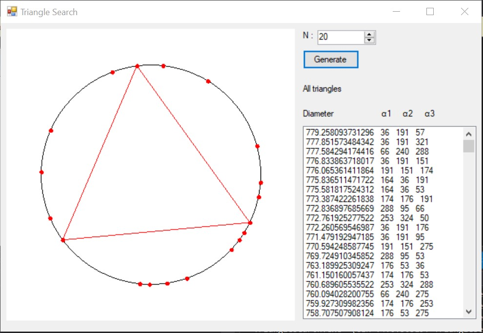
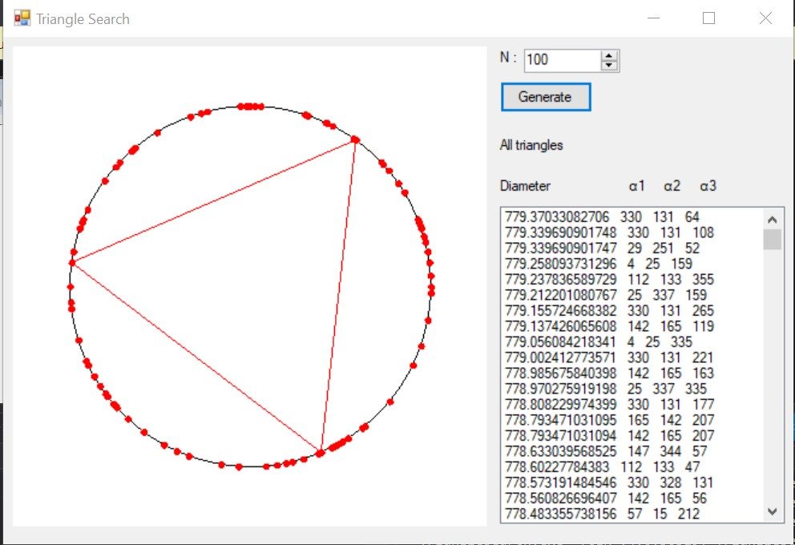
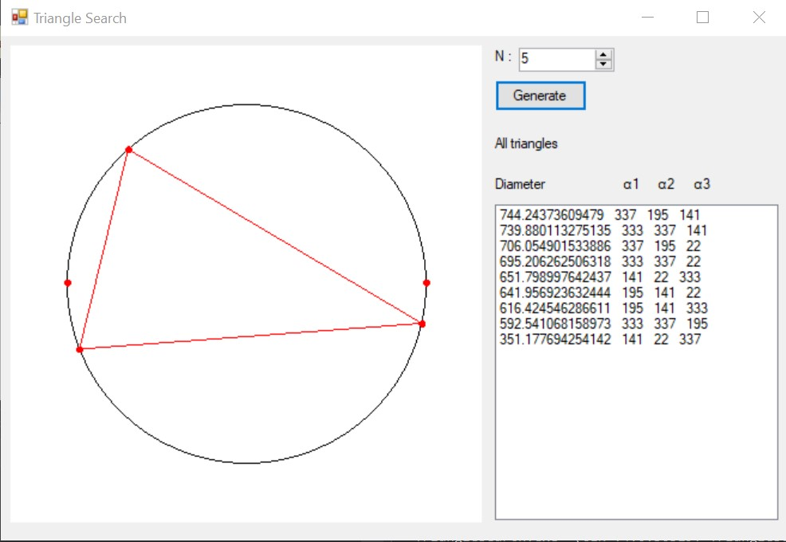

# TriangleSearch
> There are N-points on the circle. Find among them three such that form triangle with the biggest diameter.

## Table of contents
* [General info](#general-info)
* [Screenshots](#screenshots)
* [Technologies](#technologies)
* [Setup](#setup)
* [Features](#features)
* [Status](#status)
* [Contact](#contact)

## General info
This project is made for the purpose of the interview.

## Screenshots

## Code
Main logic is in [Form1.cs](https://github.com/JanaJankovic/TriangleSearch/blob/main/TriangleSearch/Form1.cs) 
Helper structs :
* [Node](https://github.com/JanaJankovic/TriangleSearch/blob/main/TriangleSearch/Node.cs)
* [Triangle](https://github.com/JanaJankovic/TriangleSearch/blob/main/TriangleSearch/Triangle.cs)

## Technologies
* C#
* WindowForms
* VisualStudio 2019

## Setup
Download the code and run it in the Visual Studio.

## Features

* Set number of nodes
* Generate random nodes based on that number
* Select triangles from list

## Status
Project is: _finished_

## Contact
Created by [@JanaJankovic](https://github.com/JanaJankovic) - feel free to contact me!
